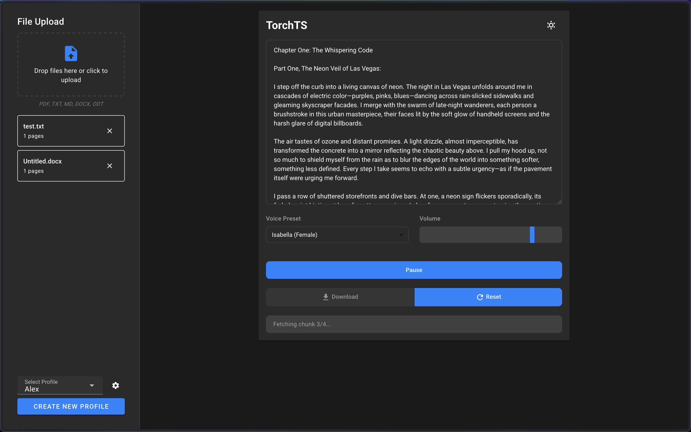
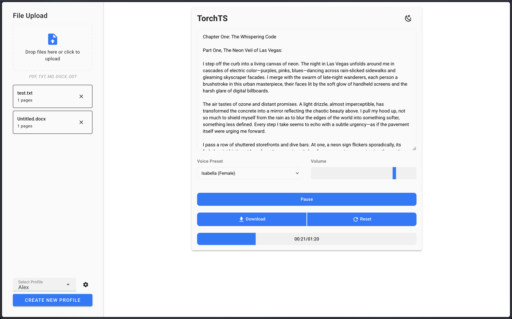

# TorchTS Project

## Overview

TorchTS is a text-to-speech application built with Python and Vue.js. It provides an interface for converting text from various document formats into speech using the Kokoro TTS model. The project combines a FastAPI backend with a Vue.js frontend to create a practical tool for text-to-speech conversion.





## Features

- **Text Processing:** Text handling and chunking utilities
- **Document Support:** Parse and extract text from PDF, DOCX, ODT, and markdown files
- **Audio Generation:** Text-to-speech conversion using Kokoro TTS
- **Profile Management:** Create and manage profiles with customizable voice and volume settings
- **File Management:** Upload, store, and organize files within profiles
- **RESTful API:** FastAPI backend endpoints for file processing and audio generation
- **Modern Interface:** Vue.js frontend with Vuetify components for a responsive design

## Project Structure

```
torchts/
├── requirements.txt           # Python dependencies
├── src/
│   ├── backend/              # Python backend
│   │   ├── api/             # API endpoints and routing
│   │   ├── storage/         # Database models and storage
│   │   ├── processing/      # Text and audio processing
│   │   └── main.py         # Main entry point
│   └── frontend/            # Frontend applications
│       └── templates/
│           └── vue/        # Vue.js application
```

## Installation

### Quick Start (Docker)

1. Clone the repository

2. Run the application:
   ```bash
   docker compose up -d
   ```
3. Access the web interface at `http://localhost:5173`

That's it! Docker will automatically set up everything needed.

### Development Setup

#### Prerequisites
- Python 3.11+
- Node.js 18+
- npm 9+
- espeak-ng (macOS only)

For local development on macOS, install espeak-ng:
```bash
brew install espeak-ng
```

#### Backend Setup (Python)

1. Create and activate a virtual environment (recommended):
   ```bash
   python -m venv .venv
   source .venv/bin/activate  # On Unix/macOS
   # or
   .venv\Scripts\activate     # On Windows
   ```
2. Install dependencies:
   ```bash
   pip install -r requirements.txt
   ```
3. Start the backend server:
   ```bash
   python src/backend/main.py
   ```

#### Frontend Setup (Vue.js)

1. Navigate to the Vue directory:
   ```bash
   cd src/frontend/templates/vue
   ```
2. Install dependencies:
   ```bash
   npm install
   ```
3. Start development server:
   ```bash
   npm run dev
   ```

## Usage

1. Access the web interface at `http://localhost:5173` after starting both the backend and frontend servers.
2. Create a profile by clicking "Create New Profile" and setting your preferred voice and volume settings.
3. Upload text or documents to your profile using the file upload area.
4. Click on any uploaded file to load its content into the text editor.
5. Adjust voice settings if needed and click "Convert to Speech" to generate audio.
6. Use the profile settings (cogwheel icon) to manage your files and profile.

### Keyboard Controls

- **Space**: Play/Pause audio
- **←/→**: Seek backward/forward 5 seconds
- **↑/↓**: Increase/decrease volume by 5%

### Profile Management

- **Create Profile:** Set up profiles with custom voice presets and volume settings
- **Upload Files:** Each profile maintains its own collection of uploaded files
- **File Organization:** Files are stored per profile for better organization
- **Profile Settings:** Access profile settings via the cogwheel icon to:
  - Delete all files in the profile
  - Delete the entire profile and its associated files

## Contributing

Feel free to open issues or submit pull requests if you'd like to contribute to the project.

## License

This project is licensed under the MIT License.

## Acknowledgments

- This project relies heavily on the [Kokoro-82M](https://github.com/hexgrad/kokoro) text-to-speech model created by [hexgrad](https://huggingface.co/hexgrad/Kokoro-82M). Their work on developing this high-quality TTS model made this project possible.
- Built with FastAPI, Vue.js, and Vuetify
